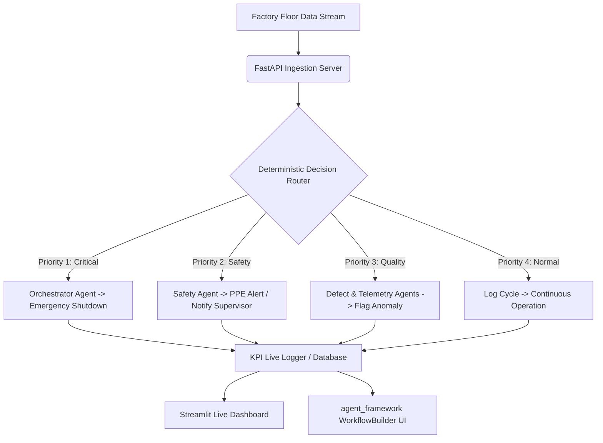

# FactoryMind – Autonomous Multi-Agent Factory Monitor

Real-time defect, telemetry, and PPE safety monitoring for factory floors. Powered by **5 specialist agents** coordinated by a deterministic Python router—ensuring **zero LLM guessing** on safety-critical decisions.

Built for the **AMD Hackathon** using **Qwen2.5-VL** accelerated via **AMD ROCm**.

---

## 🚀 Features

* **Defect Analysis Agent:** Vision / CCTV based surface and structural defect detection.
* **Telemetry Agent:** Vibration / temperature / RPM anomaly detection.
* **Safety Agent:** PPE compliance monitoring (`helmet`/`hard_hat`, `gloves`, `safety_vest`). Flags a `SAFETY_ALERT` immediately upon identifying missing gear.
* **Deterministic Decision Router:** A pure Python multi-level prioritization filter that guarantees safety and critical events take precedence over all other inputs.
    * **Priority Matrix:** `Critical` > `Safety` > `Quality` > `Normal`
    * **Critical Keywords:** `OVERHEAT`, `FAILURE_ALERT`, `CRITICAL`, `SHUTDOWN`
    * **Safety Keywords:** `SAFETY_ALERT`, `HELMET`, `PPE`, `VEST`, `GLOVE`, `FALL`
    * **Quality Keywords:** `DEFECT_ALERT`, `ANOMALY`, `OVERSPEED`, `PRESSURE`, `RPM`, `FLAG`, `UNSTABLE`
* **Orchestrator Agent:** Automates system interventions: `shutdown_conveyor`, `notify_supervisor`, `flag_anomaly`.
* **KPI Live Logging:** Tracking of parameters like `falling_risk_score`, `accident_prediction_score`, `ppe_violations`, `defects_caught`, and `downtime_saved_hrs`.
* **Dev UI Visualizer:** Low-code runtime tracking using `agent_framework WorkflowBuilder` at `http://127.0.0.1:8080`.
* **Streamlit Dashboard:** Live KPI control panel monitoring line state at `http://localhost:8501`.

---

## 🏗️ Architecture & Decision Flow



---

## 📂 Project File Structure

```text
amd-hackathon/
├── agents/
│   ├── defect_analysis_agent/
│   │   └── defect_analysis_agent.py
│   ├── telemetry_agent/
│   │   └── telemetry_agent.py
│   ├── safety_agent/
│   │   └── safety_agent.py
│   ├── orchestrator_agent/
│   │   └── orchestrator_agent.py
│   └── scene_description_agent/
│       └── scene_description_agent.py
├── workflows/
│   └── factory_workflow.py      # Decision router, run_factory_cycle, WorkflowBuilder Dev UI server
├── tools/
│   └── kpi_tools.py              # log_kpi_live() -> writes risk scores, violations & defects
├── api/
│   └── ingestion_api.py          # FastAPI endpoints: /api/telemetry/poll, /api/video/stream
├── main.py                       # Runs the continuous factory cycle loop
├── dashboard.py                  # Streamlit live operational KPI dashboard
├── requirements.txt              # Project dependencies
└── hermes.jinja                  # Chat template for vLLM
```

---

## 🛠️ Prerequisites

* **Python:** Version `3.10+`
* **Hardware:** AMD GPU configured with **ROCm 6.0+**
* **Inference Engine:** `vLLM` built with native ROCm support
* Python packages: `pip`, `venv`

---

## ⚙️ Installation & Setup

### 1. Start vLLM Server (Qwen2.5-VL)
Execute this command to boot your inference environment optimized for the AMD ROCm pipeline:
```bash
vllm serve Qwen/Qwen2.5-VL-7B-Instruct   --host 0.0.0.0   --port 8000   --enable-auto-tool-choice   --tool-call-parser hermes   --max-model-len 4096   --gpu-memory-utilization 0.4   --chat-template ./hermes.jinja
```

### 2. Create and Activate Virtual Environment
Isolate project requirements within a python virtual workspace:
```bash
python -m venv agentenv
source agentenv/bin/activate
# Windows users use: agentenv\Scriptsctivate
```

### 3. Install Dependencies
Install all required libraries into your environment:
```bash
pip install -r requirements.txt
```

Your `requirements.txt` file should include at minimum:
```text
agent-framework
fastapi
uvicorn
httpx
streamlit
pandas
plotly
pycloudflared
```

---

## 🚀 Running the Components

Ensure each component below is run inside a separate terminal window with your `agentenv` virtual environment activated.

### Step 1: FastAPI Ingestion Server
Launches ingestion routes on port `8001` to accept streaming metrics.
```bash
cd api
fastapi dev ingestion_api.py --port 8001
```
* **Active Endpoints:**
  * Telemetry Endpoint: `http://localhost:8001/api/telemetry/poll`
  * Video Ingest Endpoint: `http://localhost:8001/api/video/stream`

### Step 2: Factory Workflow Engine (Main Cycle)
To run the continuous live processing logic looping `run_factory_cycle()` and passing logs to `log_kpi_live()`, execute from the repository root:
```bash
python main.py
```

#### Alternative: Launch agent_framework Dev UI
To use the visual mapping graph pipeline tool (`WorkflowBuilder`) instead of raw runtime console logs, run:
```bash
python workflows/factory_workflow.py
```
Open your browser and navigate to: `http://127.0.0.1:8080`  
*Exposed Platform Entities:* `defect_agent`, `telemetry_agent`, `safety_agent`, `orchestrator_agent`, `decision_router_agent`, `scene_agent`, `factory_workflow`.

### Step 3: Streamlit Production Dashboard
Launch the visualization dashboard layer directly on port `8501`:
```bash
streamlit run dashboard.py   --server.port=8501   --server.address=0.0.0.0   --server.enableCORS=false   --server.enableXsrfProtection=false   --server.enableWebsocketCompression=false   --server.headless=true   --server.fileWatcherType=none
```
Open your browser and navigate to: `http://localhost:8501`

**Dashboard Monitors:**
* Total Defects caught, Safety violations, and Downtime saved (hrs)
* Real-time metrics: `falling_risk_score`, `accident_prediction_score`
* PPE checking updates (`helmet` / `gloves` / `safety_vest`)
* Live interactive trend charts and historical cycles table

#### Public Deployment Hook (Cloudflare Tunnel)
If executing inside an unmapped remote instance or cloud workbook environment (like Jupyter Notebooks), expose your panel to the internet using this initialization script:
```python
from pycloudflared import try_cloudflare

url = try_cloudflare(port=8501)
print(f"[*] Live Dashboard URL: {url}")
```
Open the outputted `https://*.trycloudflare.com` domain to interact with your dashboard globally.

---

## 🧪 Quick Test Scenarios

Trigger manual simulated payloads inside the Dev UI visual builder layer (`http://127.0.0.1:8080`) to ensure routing behaves correctly:

### Scenario 1: Normal Routine
```text
detected_objects: [gear, conveyor]
vibration: 2.1
temp: 45
```
* **Routing Output:** `decision=normal`, `action_taken=none`

### Scenario 2: Quality Deviation (Overspeed Anomaly)
```text
detected_objects: [gear, defect]
vibration: 12.5
temp: 68
```
* **Routing Output:** `decision=quality_defect`, `action_taken=flag_anomaly`

### Scenario 3: Safety Risk (Missing PPE Equipment)
```text
detected_objects: [person, no_helmet]
vibration: 3.0
temp: 50
```
* **Routing Output:** `decision=safety_violation`, `action_taken=notify_supervisor`
* **Side-Effects:** `ppe_violations=helmet`, metrics `falling_risk_score` 📈, `accident_prediction_score` 📈.

---

## 📊 KPI Data Schema

The reporting function `log_kpi_live()` outputs dataset objects tracing these structured fields:
```text
input_vibration, input_temp, input_detected_objects,
video_description, agent_decision, alert_type, action_taken,
machine_id, downtime_saved_hrs, defects_caught, safety_violations,
safety_description, falling_risk_score, accident_prediction_score,
ppe_violations
```

---

## 🛠️ Troubleshooting

* **ResponseStream / user_input_requests in Dev UI:** Do not wrap `agent.run` loops in `workflows/factory_workflow.py`. The framework configurations keep `_make_streaming` as an explicit no-op for system stability on `agent_framework==1.0.0b260528`.
* **Streamlit missing ScriptRunContext:** This terminal startup warning is completely safe to ignore. If your dashboard views are blank, verify that the log path designated inside `log_kpi_live()` is matching the file path targeted for parsing inside `dashboard.py`.
* **vLLM Out Of Memory (OOM):** Reduce GPU allocation thresholds down via `--gpu-memory-utilization 0.3` or limit maximum visual prompt token constraints via `--max-model-len 2048`.
* **Port Conflicts (FastAPI 8001):** If the port is locked, identify and kill the processes before initializing:
  ```bash
  lsof -i :8001
  kill -9 <PID>
  fastapi dev ingestion_api.py --port 8001
  ```

---

## 📄 License

This framework is built for the **AMD Hackathon** under the **MIT License**.
